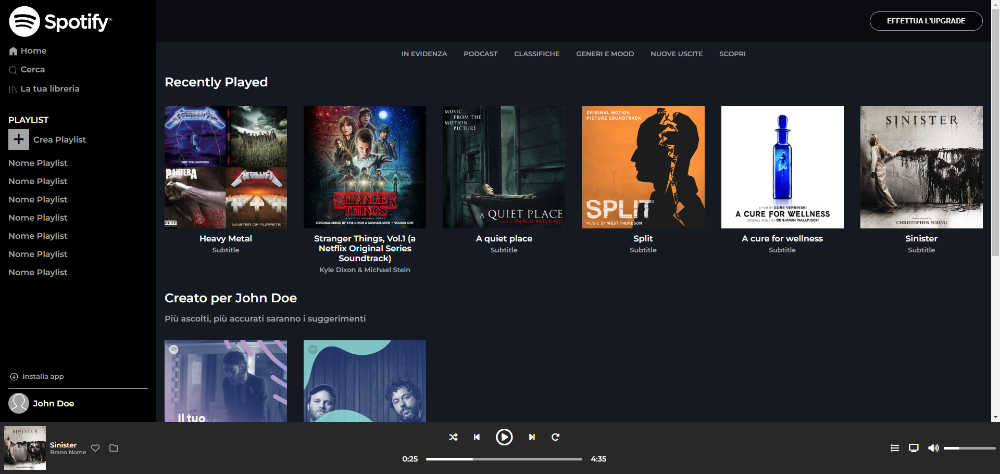
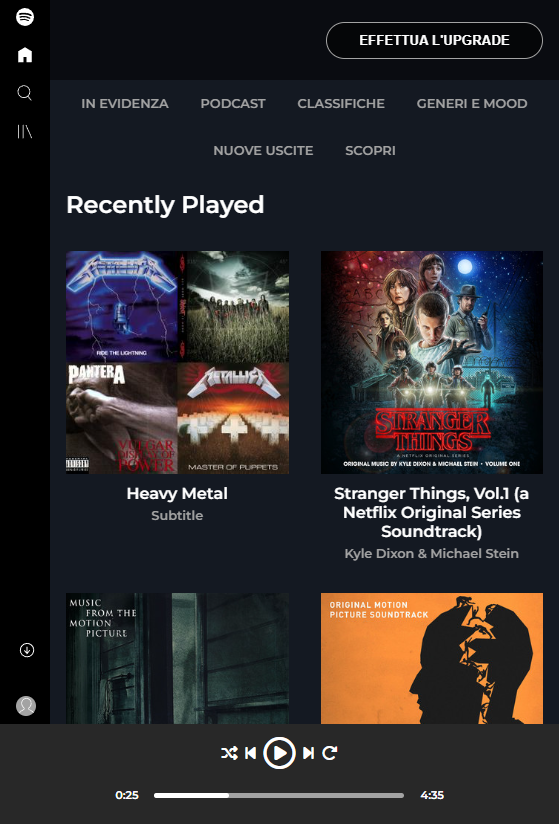

# SPOTIFY WEB

Replica of Spotify Web App. The page is responsive, with static data. Added effects on buttons with mouse hover.

- I created a web app, a copy of Spotify web, using Bootstrap. The web app is responsive, buttons have a hover effect, and the internal content is scrollable.

_Boolean exercise with responsive layout_

## Technologies and Libraries

- HTML
- CSS
- Fontawesome
- Bootstrap

## ScreenShot

**Desktop**

**Mobile**

